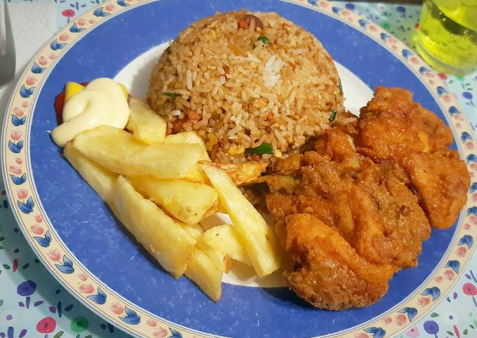
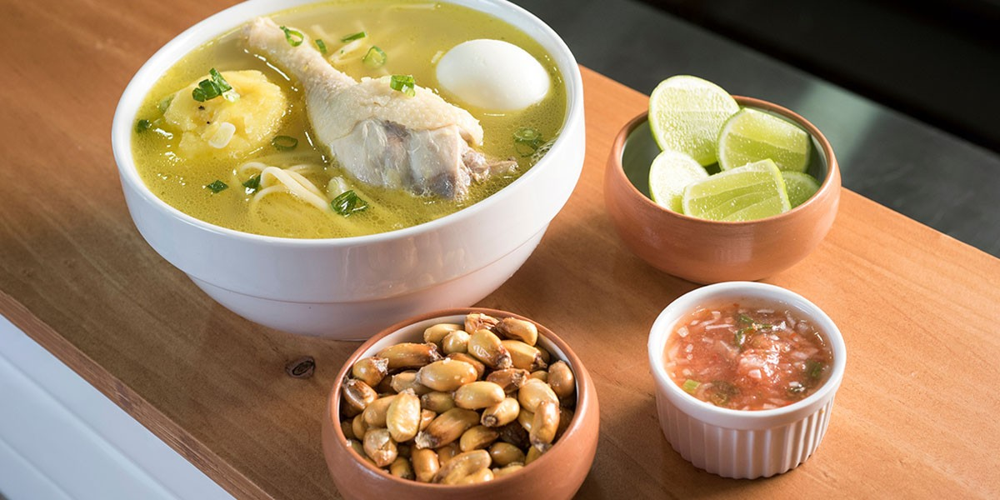
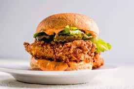
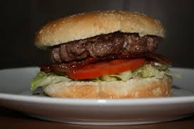

<!DOCTYPE html>
<html lang="es">

<head>
    <meta charset="UTF-8">
    <title>Ejemplo de div y css</title>
    <link rel="stylesheet" href="estilo.css">
    

</head>

<body>
    

        

            <h2> El SABOR DE ESTELITA POLLOS BROSATER TU DELICIA</h2>
        

        

            
Productos en ventas:

            
            
            
             
            
POLLO BROASTER

            
CALDO DE GALLINA

            
MOSTRITO

             
            
            
            
HAMBURGUESA DE BROASTER

            
HAMBURGUESA DE CARNE

        

        

            <h3 class="h3-menor">HORA DE ATENCION DE LAS 12:OO PM HASTA LAS 11:PM</h3>
        

        

            HOY 1/01/2024
        

    

</body>

</html>
